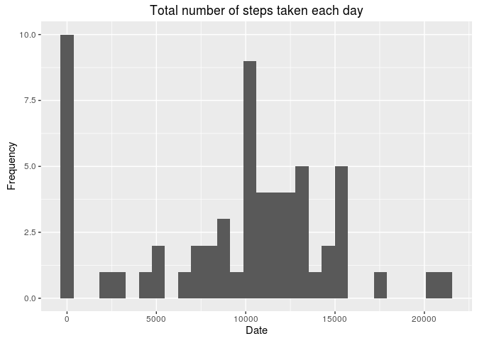
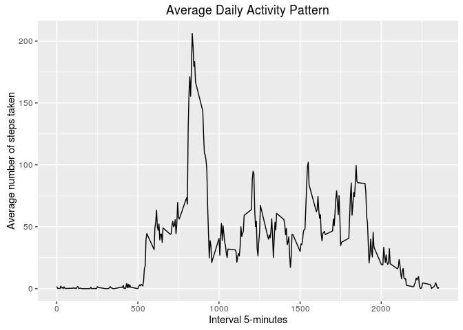
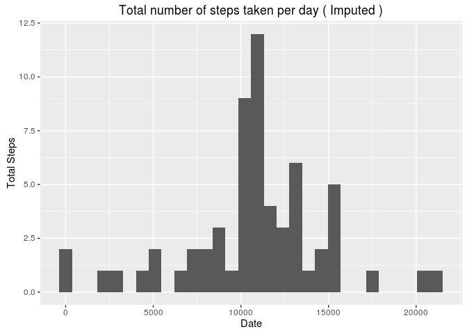
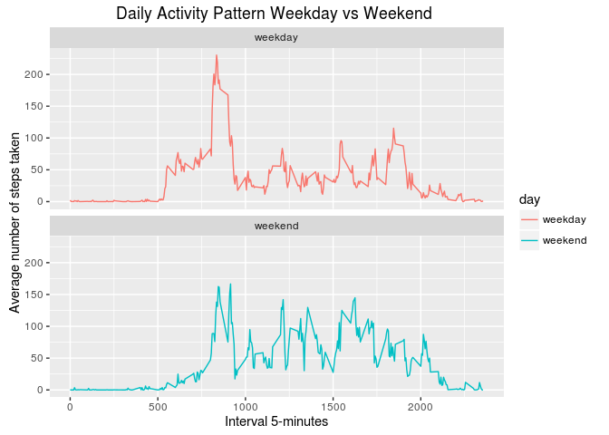

# Reproducible Research: Peer Assessment 1

Loading Libraries

```r
library(dplyr)
library(ggplot2)
library(tidyr)
library(lubridate)
```

unzipping dataset

```r
unzip(zipfile="./activity.zip",exdir="./")
```

## Loading and preprocessing the data
reading dataset and formatting Date


```r
dataset <- read.csv("activity.csv")
dataset$date <- ymd(dataset$date)
```

## What is mean total number of steps taken per day?
Grouping data by date and then summarizing it over steps


```r
dataByDate <- group_by(dataset, date)
stepsPerDay <- summarise(dataByDate, totalSteps = sum(steps, na.rm = T))

qplot(totalSteps, data = stepsPerDay,
      xlab = "Date", ylab = "Frequency",
      main = "Total number of steps taken each day") 
```

<!-- -->

calculating mean and median

```r
meanSteps <- mean(stepsPerDay$totalSteps)
medianSteps <- median(stepsPerDay$totalSteps)
```
mean is **9354.2295082** and median is **10395**

## What is the average daily activity pattern?
Grouping data by Interval and then summarizing it over steps

```r
dataByInterval <- group_by(dataset, interval)
stepsPerInterval <-  summarise(dataByInterval,
                               totalSteps = mean(steps, na.rm = T))
ggplot(data = stepsPerInterval, aes(x = interval, y = totalSteps)) + geom_line() +
    xlab("Interval 5-minutes") + 
    ylab("Average number of steps taken") +
    ggtitle("Average Daily Activity Pattern")
```

<!-- -->

calculating interval having maximum number of steps on average


```r
maxInterval <- stepsPerInterval[which.max(stepsPerInterval$totalSteps),]
interval <- maxInterval$interval
totalSteps <- maxInterval$totalSteps
```

Interval is **835** and number of steps are **206.1698113**

## Imputing missing values


```r
missingRows <- sum(!complete.cases(dataset))
```
Total number of Missing Values (NA) in the dataset are **2304**  

imputing dataset by mean value of intervals and **rounding** to the nearest value


```r
imputedDataset <- dataset
for (i in 1:nrow(imputedDataset)) {
    if(is.na(imputedDataset$steps[i])){
        imputedDataset$steps[i] <-  as.integer(round(stepsPerInterval[stepsPerInterval$interval %in% imputedDataset$interval[i],'totalSteps']))
    }
}
head(imputedDataset)
```

```
##   steps       date interval
## 1     2 2012-10-01        0
## 2     0 2012-10-01        5
## 3     0 2012-10-01       10
## 4     0 2012-10-01       15
## 5     0 2012-10-01       20
## 6     2 2012-10-01       25
```

```r
sum(!complete.cases(imputedDataset))
```

```
## [1] 0
```

plotting histogram


```r
dataByDateI <- group_by(imputedDataset, date)
stepsPerDayI <- summarise(dataByDateI, totalSteps = sum(steps))

qplot(totalSteps, data = stepsPerDayI,
      xlab = "Date", ylab = "Total Steps",
      main = "Total number of steps taken per day ( Imputed )") 
```

```
## `stat_bin()` using `bins = 30`. Pick better value with `binwidth`.
```

<!-- -->

Calculating mean and median of imputed data

```r
meanStepsI <- mean(stepsPerDayI$totalSteps)
medianStepsI <- median(stepsPerDayI$totalSteps)
```
The imputed data mean is **1.0765639\times 10^{4}**
The imputed data median is **10762**

Calculate difference between imputed and non-imputed data

```r
mean_diff <- meanStepsI - meanSteps
med_diff <- medianStepsI - medianSteps
```
- change in mean is (imputed - normal) is  **1411.4098361**
- change in meadian is (imputed - normal) is  **367**


## Are there differences in activity patterns between weekdays and weekends?

adding factor variable day in dataframe


```r
imputedDataset <- mutate(imputedDataset, day = ifelse(wday(date) %in% c(1,7), "weekend", "weekday"))
imputedDataset$day <- as.factor(imputedDataset$day)
head(imputedDataset)
```

```
##   steps       date interval     day
## 1     2 2012-10-01        0 weekday
## 2     0 2012-10-01        5 weekday
## 3     0 2012-10-01       10 weekday
## 4     0 2012-10-01       15 weekday
## 5     0 2012-10-01       20 weekday
## 6     2 2012-10-01       25 weekday
```

summerising over interval and day and plotting


```r
dataByIntervalI <- group_by(imputedDataset, interval,day)
stepsPerIntervalI <-  summarise(dataByIntervalI, totalSteps = mean(steps))

ggplot(stepsPerIntervalI, aes(x=interval, y=totalSteps, color = day)) +
    geom_line() +  facet_wrap(~day, ncol = 1, nrow=2) +
    xlab("Interval 5-minutes") + 
    ylab("Average number of steps taken") +
    ggtitle("Daily Activity Pattern Weekday vs Weekend ")
```

<!-- -->

Through plot it can be seen that the person is more active throught the weekend compared to weekdays except the early intervals (might be sleeping more as it's weekend :P)
